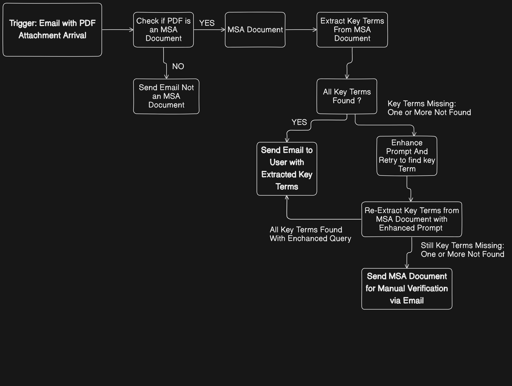

## Enterprise scale automation with MSFT Power Automate

For this lab, we are using Power Automate to create and manage automated workflows. This tool helps streamline repetitive tasks, improve efficiency, and integrate various services seamlessly. 

In this flow, you will learn how you can automate workflows, we will also cover reflection where we will check if the extracted terms meet our expectation. For example, if they all terms are extracted and they don't have "not found" key term from contract - in cases where we do have not found terms we call "human in loop" to verify and respond to customers.

## What is Power Automate?  

Power Automate is a **low-code, drag-and-drop automation tool** by Microsoft that enables users to **automate repetitive tasks and business processes** across various apps and services. Previously known as **Microsoft Flow**, it integrates seamlessly with **Microsoft Office 365** and **Microsoft Azure**, helping boost productivity by eliminating manual workflows.  

With **150+ standard connectors** (and additional premium ones), Power Automate supports everything from **simple task automation to complex system workflows**, allowing users to focus on more strategic work.  

🎥 **Watch this video to learn more:** [Power Automate Overview](https://youtu.be/yVAEH6-ui0w?si=Ne3pXYQp-uZnHGOR)  

# Note: Account Creation Prerequisite

**To create your account and access the 30-day free trial, you will need a valid work or college email address. If you don't have a work or college email address, please don't go further. Reach out to our team and they will help you.**

### Step 1:  
> **Click on** [this link](https://make.powerautomate.com) **to be redirected to Power Automate.**
.png)

### Step 2:  
> **Click on "Create one"** to start setting up your account.  
.png)

### Step 3:  
> **Enter your email address** and proceed to the next step.Provide your basic details like **Date of Birth (DOB)** and enter the **OTP** sent to your email for verification.
.png)

### Step 4:  
> Once you create your account, you will be redirected to the **Power Automate Dashboard**, which will look something like this:  

.png)  

# Let's Start with My Flow  

In this section, we will go through the **flow** that I have created using Power Automate. This flow automates tasks efficiently and enhances productivity. Let's dive in! 🚀 

  

## Step 1: Importing the Flow  

> **1. Click on "My Flows"** in the sidebar.  
> **2. At the top, click on "Import".**  
> **3. Select the Import Package** you want to import.  
> **4. You will be redirected to the upload page.**  

.png)  

## Step 2 : Uploading the Flow  

> **1. Select and upload the **ZIP file** that has been provided to you in the repo.** 

## **"This is the ZIP file you need. Just click on the file and download it from the top."**
.png)
.png)

> **2. Click on "Upload"** 

## Step 3: Flow Imported Successfully ✅  

.png)  

> **1 Once you upload your package file, click on "Update"**. 
.png)
> **2. From the dropdown above, select "Create as New".**  
.png)
> **3. Click on the "Save" button" to finalize the import process.**  
> **4. Click on "Select During Import".**  
.png)
> **5. You will see your email address—select it.**  
.png)
> **6. Click on the "Save" button.**  
> **7. Repeat the same procedure for the below required connection as well.**  
> **8. Make sure all the connections are marked with a ❌ cross symbol before clicking the "Import" button.**  
.png)

### 📌 Step 4 : Final Step: Accessing Your Imported Flow   

> **1. Once you click on "Import", you will see a confirmation message that the package has been imported successfully.**  
> **2. Once the flow is imported, go to 'My Flow' in the sidebar, click on your flow, and then click 'Turn On,' as shown in the image.**  
.png)
> **3."Now, click on the 'Edit' option."**
.png)
## Step 5 : Interacting with Your Flow  

Now that your flow has been successfully imported, you can see it in your **My Flows** section.  
.png)

## **Note : In Condition 3, if the condition is false, click on the Email component. In the sidebar, provide a different email address to which the document should be sent for human evaluation. Enter the email of the specific human reviewer or admin.**

.png)

## **When using this agent, you might be prompted to log in to an agent account. You will need to log in to another app, and you will receive a notification indicating that login is required to access it. Please note that the agent account comes with a 30-day free trial.**
.png)

> **Feel free to explore and experiment with it!** 🎯  
> You can modify actions, add conditions, or test the flow to ensure it works as expected.  

# Step 6 : Demo Video  

## Demo Video 1  
In this video, I extract all the key terms from the MSA document and pass them to the user, showing the extracted terms.  
📄 [Reference Doc Link](https://drive.google.com/file/d/13LbQtQTd43SMMokCSB1JHcg3V5B0Qgvo/view?usp=sharing)  
🎬 [Watch Demo Video 1](https://drive.google.com/file/d/1DUcY_b7Q0yZDd-4qxagVOltawgOMvwCu/view?usp=sharing)  

## Demo Video 2  
If any key term is not found, the system enhances the query and tests again. If still not found, it sends an email to the admin for manual review.  
📄 [Reference Doc Link](https://drive.google.com/file/d/1o9FG4zd4C0GwKTjMvumNzIS6UoGobFOd/view?usp=sharing)  
🎬 [Watch Demo Video 2](https://drive.google.com/file/d/14AQZ-Z87t2dgsRTX13uZKM9O4jnoGyok/view?usp=sharing)  

## Demo Video 3  
If the attachment contains irrelevant content, the flow will not proceed.  
🎬 [Watch Demo Video 3](https://drive.google.com/file/d/1hAJg4cDSTOr0P0pl_wDuaa8EuoDQYPc_/view?usp=sharing)  

🚀 **Start automating now!**  
